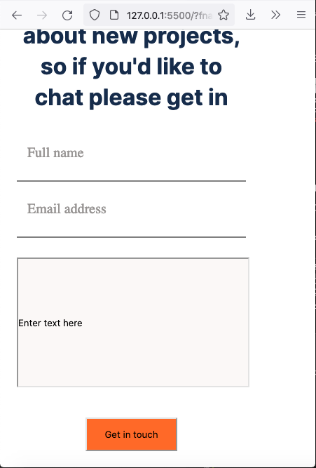

# Project Name

> Portfolio Contact Form

A contact form for a portfolio website.

Application is based on this [Figma design](https://www.figma.com/file/t3EJUCAEViw3QasuJLPLVT/Microverse-Student-Potfolio-Templates-Main?node-id=1%3A1471).

## Built With

- HTML
- CSS

## Live Demo

[View Demo here](https://raw.githack.com/t-yanick/contact-form/contact-form-workplace/index.html)

## Getting Started

To get a local copy up and running follow these simple example steps.

### Prerequisites

- Web browser

### Setup

Download or clone the project into a local directory

### Usage

Open the index.html file in the web browser

## Authors

👤 **Author**

- GitHub: [@t-yanick](https://github.com/t-yanick)
- Twitter: [@ElTazoh](https://twitter.com/ElTazoh)
- Linkedin: [tazoh-yanick](https://linkedin.com/in/tazoh-yanick)

## 🤝 Contributing

Contributions, issues, and feature requests are welcome!

Feel free to check the [issues page](https://github.com/t-yanick/contact-form/issues).

## Show your support

Give a ⭐️ if you like this project!

## Acknowledgments

- Hat tip to anyone whose code was used
- Inspiration
- etc

## 📝 License

This project is [MIT](./MIT.md) licensed.

You are contributing contribute the code back to the official coolapp repo, but you realize there is a really dumb typo in one of your source code comments (not commit messages) in commit M. You'd still like to submit the pull request as two commits M' and N', where M' is the fixed version of M, and N' is the same exact diff as N. How do you rewrite git history to make this happen?
Is N' the same hash as N? Why or why not?